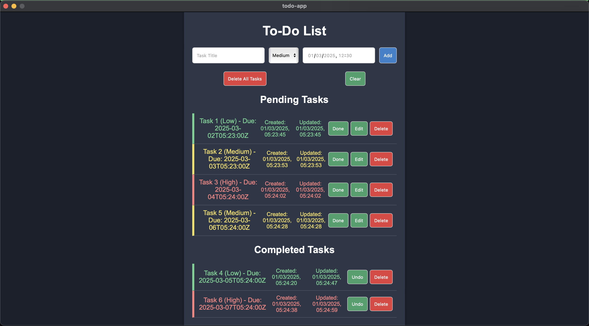
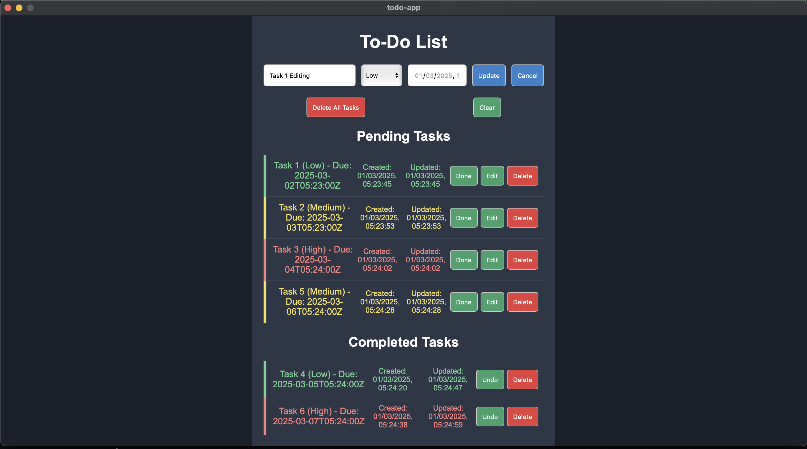
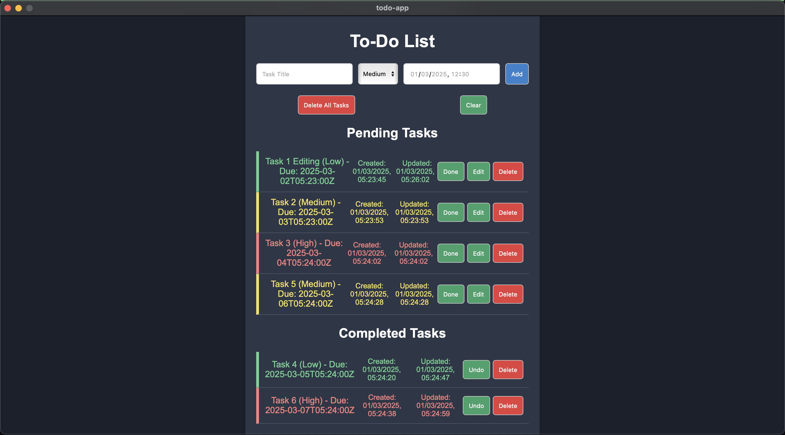
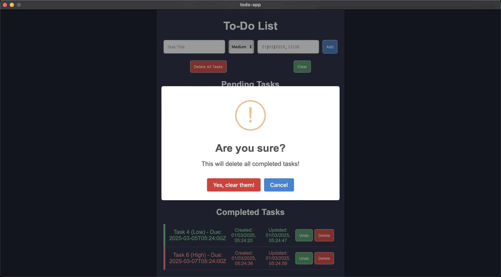
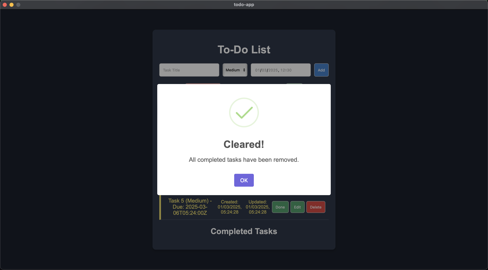
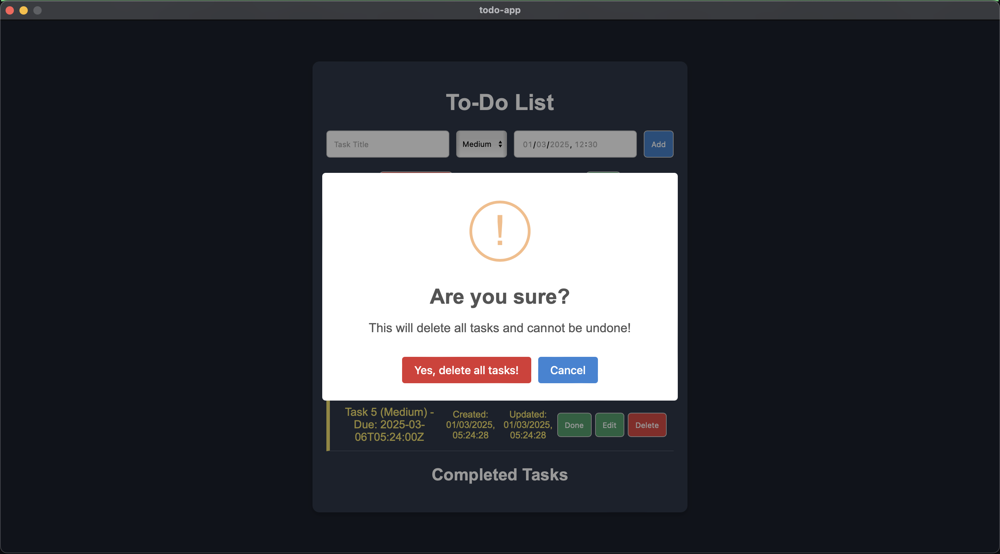
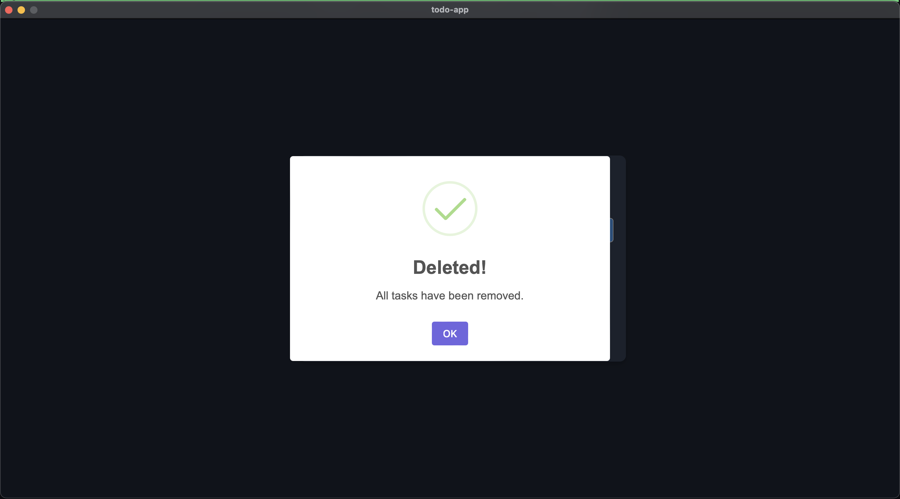

# To-Do List Application

This is a feature-rich To-Do List application built with React and Wails (Go backend). It allows users to manage tasks efficiently with priority levels and persistent storage.

## Preview









## Features

- **See list of tasks**

- **Add new tasks with priority and due date**

- **Mark tasks as done/undone**

- **Delete tasks**

- **Restore completed tasks**

- **Priority levels with color-coded labels**

- **Persistent storage using **SQLite** with **Go** backend**

- **Modern UI with styled buttons and icons**

## Technologies Used

- **Frontend**: React, TypeScript, CSS

- **Backend**: Go (using Wails)

- **Database**: SQLite (for persistent storage)

## Installation

### Prerequisites

- Node.js (for React)

- Go (for Wails)

- SQLite (for data storage)

- Wails installed (`go install github.com/wailsapp/wails/v2/cmd/wails@latest`)

### Steps

1. Clone this repository:

   `git clone https://github.com/bakdauletbaktygaliyev/go-todo-wails.git go-todo-wails && cd go-todo-wails`

2. Install frontend dependencies:

   `npm install`

3. Run the application:

   `wails dev`

## Project Structure

```
TODO-APP/
│
├── backend/                     # Backend logic (Go)
│   ├── models/                  # Data models (structs, data types)
│   │   └── task.go              # Defines the Task model structure
│   │
│   ├── service/                 # Business logic layer
│   │   └── service.go           # Core functions for task management
│   │
│   └── storage/                 # Database and storage layer
│       ├── sqlite/              # SQLite-specific implementation
│       │   └── sqlite.go        # Handles SQLite operations (CRUD)
│       └── storage.go           # Defines storage interface abstraction
│
├── build/                       # Build artifacts (auto-generated)
│
├── frontend/                    # Frontend (Vite + TypeScript)
│   ├── dist/                    # Compiled frontend output (for production)
│   ├── src/                     # Frontend source code (React/Vue/Svelte, etc.)
│   ├── wailsjs/                 # Auto-generated bindings between Go & JS
│   ├── index.html               # Frontend entry point
│   ├── package.json             # Frontend dependencies & scripts
│   ├── tsconfig.json            # TypeScript configuration
│   ├── tsconfig.node.json       # TypeScript config for Node build tools
│   └── vite.config.ts           # Vite build and dev server configuration
│
├── screens/                     # UI screen components or pages
│
├── app.go                       # Wails application initialization
├── main.go                      # Entry point of the Go application
├── go.mod                       # Go module definition (dependencies)
├── go.sum                       # Go module checksums
├── tasks.db                     # SQLite database file (persistent data)
├── wails.json                   # Wails project configuration (frontend/backend link)
├── .gitignore                   # Files and directories ignored by Git
└── README.md                    # Project documentation
```

## License

This project is licensed under the MIT License.
